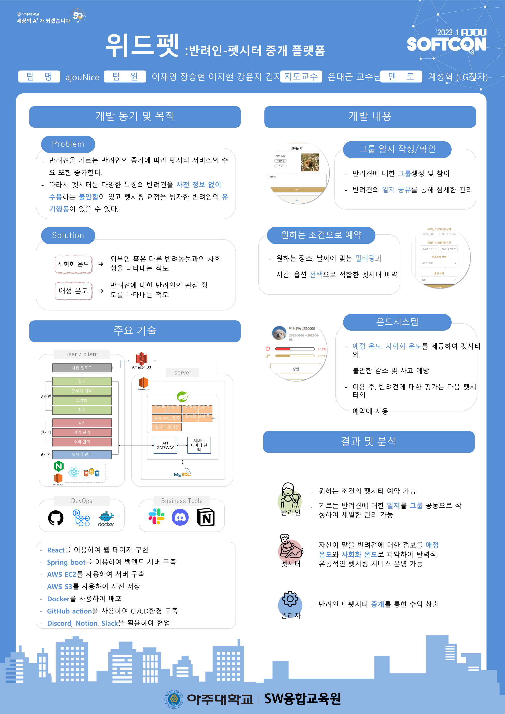

# 위드펫

### 프로젝트 소개

> ‘위드펫’은 반려인과 펫시터를 중개하는 플랫폼입니다.
펫시터는 반려견의 사회화 온도(사람 혹은 다른 반려견과의 사회성을 나타내는 척도)와 반려인의 애정도(반려견에 대한 관심도)를 확인하고 수락 및 거부하며 서비스를 유동적으로 관리할 수 있습니다.
> 

### 위드펫의 기능

1. 그룹 일지 작성 및 조회 기능
    - 반려인은 그룹에 소속된 반려견에 대한 일지를 작성 및 조회할 수 있습니다.
2. 원하는 조건의 펫시터 예약 기능
    - 반려인은 원하는 조건의 펫시터를 필터링하여 찾을 수 있으며 돌봄 서비스를 예약할 수 있습니다.
3. 온도 시스템 기능
    - 펫시터는 온도 정보를 조회하여 반려견의 사회성 정도와 반려인의 반려견 관심 정도를 파악한 후 예약을 승낙 및 거절할 수 있습니다.

### ajouNice 팀

| role | name | part | email | github |
| --- | --- | --- | --- | --- |
| 팀장 | 이재영 | 프론트 개발 | mailto:joe981125@ajou.ac.kr | https://github.com/2jaeyoung2 |
| 팀원 | 이지현 | 프론트 개발 | mailto:wlgus97@ajou.ac.kr | https://github.com/wlgus8284 |
| 팀원 | 강윤지 | 프론트 개발 | mailto:dbswl701@ajou.ac.kr | https://github.com/dbswl701 |
| 팀원 | 장승현 | 백엔드 개발 | mailto:jason5102@ajou.ac.kr | https://github.com/j-seunghyun |
| 팀원 | 김지수 | 백엔드 개발 | mailto:chensa1018@ajou.ac.kr | https://github.com/strongcookdas |

### 배포 주소

**프론트엔드 메인 페이지 URL** 

[http://ec2-13-125-242-183.ap-northeast-2.compute.amazonaws.com](http://ec2-13-125-242-183.ap-northeast-2.compute.amazonaws.com/petlist)

**백엔드 스웨거 URL**

https://withpet.site/swagger-ui/

### 서비스 내용

